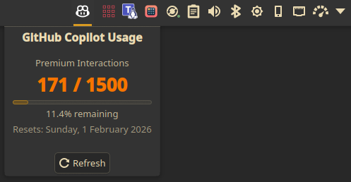

# GitHub Copilot Usage Widget for KDE Plasma

A KDE Plasma widget that displays your GitHub Copilot premium interactions quota directly in a KDE panel.

<p align="center">
  
</p>

## Features

- **Real-time Usage Tracking**: Monitor your remaining GitHub Copilot premium interactions
- **Visual Indicators**: Color-coded display showing usage level (green/yellow/red)
- **Automatic Refresh**: Configurable auto-refresh interval (default: 5 minutes)
- **Secure Authentication**: Uses the GitHub CLI (`gh`) for authentication - no token storage needed
- **Tooltip Information**: Hover to see detailed usage stats and reset date
- **Manual Refresh**: Middle-click the widget or use the refresh button to update immediately

## Requirements

- KDE Plasma 6.0 or later
- GitHub CLI (`gh`) installed and authenticated
- An active GitHub Copilot subscription

## Installation

### Method 1: Automatic Installation (Recommended)

1. Clone this repository:
   ```bash
   git clone https://github.com/robtagg/plasma-copilot-usage.git
   cd plasma-copilot-usage
   ```

2. Run the installation script:
   ```bash
   chmod +x install.sh
   ./install.sh
   ```

3. Restart Plasma Shell:
   ```bash
   kquitapp6 plasmashell && kstart plasmashell
   ```

### Method 2: Manual Installation

1. Copy the widget files to your local Plasma directory:
   ```bash
   mkdir -p ~/.local/share/plasma/plasmoids/com.github.copilot-usage
   cp -r metadata.json contents ~/.local/share/plasma/plasmoids/com.github.copilot-usage/
   ```

2. Restart Plasma Shell:
   ```bash
   kquitapp6 plasmashell && kstart plasmashell
   ```

### GitHub CLI Setup

If you haven't already, install and authenticate with the GitHub CLI:

```bash
# Install gh (example for Fedora/RHEL)
sudo dnf install gh

# Or for Debian/Ubuntu
sudo apt install gh

# Authenticate
gh auth login
```

## Usage

### Adding the Widget to Your Panel

1. Right-click on your KDE panel
2. Select "Add Widgets..."
3. Search for "GitHub Copilot Usage"
4. Drag the widget to your desired location on the panel

### Interacting with the Widget

- **Left-click**: Open the expanded view with detailed usage information
- **Middle-click**: Manually refresh the usage data
- **Hover**: View tooltip with current usage stats and quota reset date

### Configuration

Right-click the widget and select "Configure" to access settings:

- **Refresh Interval**: Set how often the widget automatically updates (1-60 minutes)

## Troubleshooting

### Widget shows "gh not authenticated"

Run `gh auth login` to authenticate with GitHub.

### Widget shows "gh error"

1. Verify `gh` is installed: `gh --version`
2. Check authentication: `gh auth status`
3. Test API access: `gh api /copilot_internal/user`

### Widget doesn't appear after installation

1. Ensure files are in the correct location: `~/.local/share/plasma/plasmoids/com.github.copilot-usage/`
2. Restart Plasma Shell completely
3. Check for errors in the system logs: `journalctl -f`

### Data not refreshing

1. Check your internet connection
2. Verify GitHub CLI authentication hasn't expired
3. Try manually refreshing by middle-clicking the widget

## License

This project is licensed under the GNU General Public License v3.0 - see the [LICENSE](LICENSE) file for details.

## Acknowledgments

- Built for KDE Plasma 6
- Uses the GitHub CLI for secure API access
- Inspired by the need to track Copilot usage efficiently

## Support

If you encounter any issues or have suggestions, please [open an issue](https://github.com/robtagg/plasma-copilot-usage/issues) on GitHub.

---

**Note**: This is an unofficial widget and is not affiliated with or endorsed by GitHub or Microsoft.
